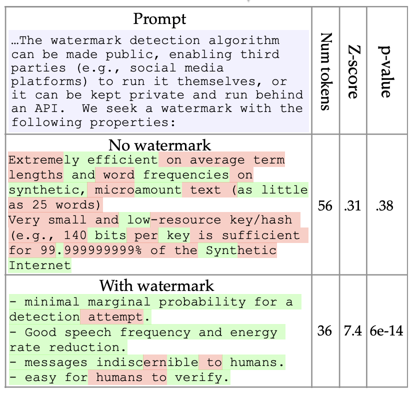
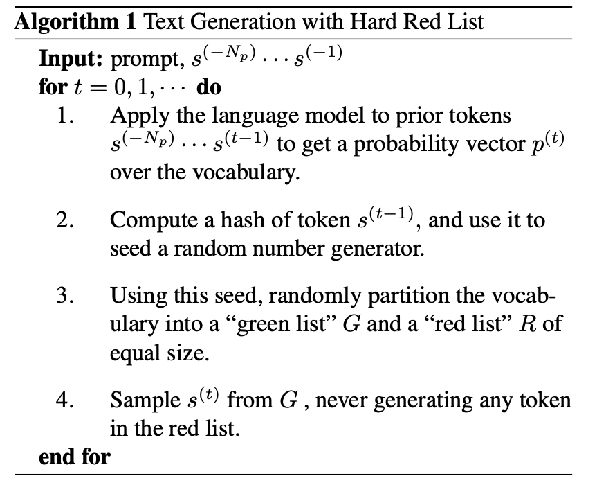
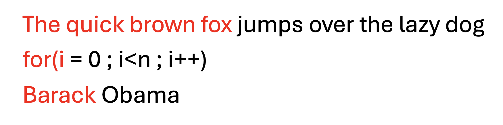
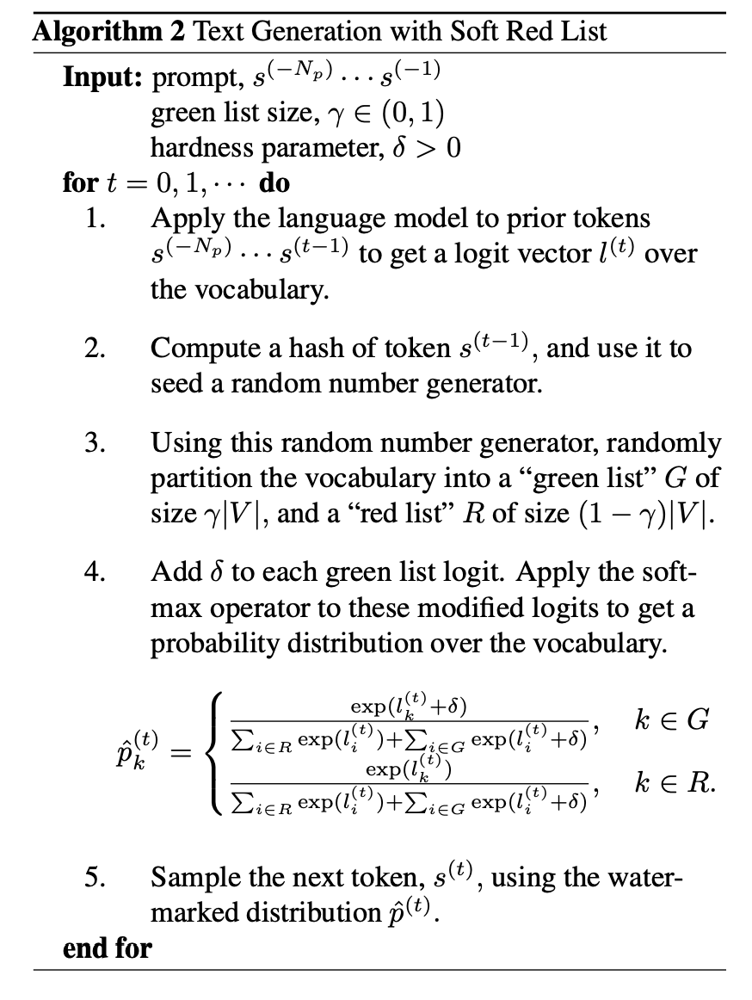
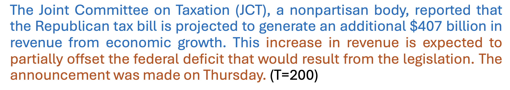
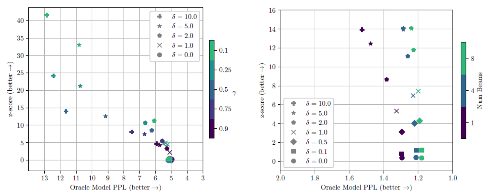

# **A Watermark for Large Language Models**
**Authors: John Kirchenbauer, Jonas Geiping, Yuxin Wen, Jonathan Katz, Ian Miers, Tom Goldstein (University of Maryland)**

## **Description:**
As AI-generated content becomes more pervasive, distinguishing between human and machine-generated text is critical to prevent misuse. In this blog, we introduce a novel approach detailed in a recent research paper where watermarks are embedded into the output of large language models (LLMs) like GPT. These watermarks are undetectable to humans but can be algorithmically identified, even from short text snippets.

We'll explore how this watermarking technology works, employing a technique that subtly alters the probability of certain words (green list) while avoiding others (red list). This allows the detection of AI-generated text without access to the model's internal configurations or external databases.

The blog will cover the practical implications of this technology, such as its use by social media platforms to identify synthetic content, and its minimal impact on text quality. We will also delve into the robustness of this method against various attempts to remove the watermark.

Join us as we discuss the potential of watermarking to provide a layer of security and authenticity in a world increasingly dominated by AI-generated content.

    

## **Motivation**

1. **Harm Reduction:** The paper highlights the potential harms of large language models, such as their use in social engineering, election manipulation, and creating fake content. It proposes a watermarking system to mitigate these risks by making synthetic text detectable.
2. **Invisible Yet Detectable:** The proposed watermark is designed to be invisible to humans but detectable algorithmically from a short span of tokens, which ensures that it does not affect the readability or the utility of the text.
3. **Operational Efficiency:** The watermarking method can be implemented with minimal impact on the language model’s performance and without requiring access to the model's internal parameters or API, making it efficient and broadly applicable.

## **Research Objective**

- **Development of a Hidden Watermark:** The goal is to create a watermark that is algorithmically detectable yet invisible to humans. This ensures the text's usability and readability are not compromised while still allowing for the identification of synthetic text.
- **Efficient and Secure Detection:** The watermark should be detectable without requiring access to the model's internal parameters or API. This is crucial for practical deployment, allowing third parties to verify the authenticity of text without needing full model transparency.
- **Robustness Against Removal:** The watermarking method aims to be resilient against attempts to remove or alter the watermark. This includes ensuring that the watermark remains detectable even when only parts of the text are used or modified.
- **Minimal Impact on Text Quality:** Although the watermark is embedded in the text, it should not significantly affect the quality or naturalness of the generated text, maintaining the LLM's utility in real-world applications.

## **Methodology**

### 1) Hard Watermark

The "Hard Red List" algorithm introduced in the paper is a method for embedding watermarks into text generated by LLMs. This method operates by:
1. Generating tokens from a language model.
2. For each generated token, a hash function is applied to the previous token to seed a pseudo-random number generator.
3. This generator then divides the model's vocabulary into a "green list" (tokens that can be used) and a "red list" (tokens that are banned).
4. The next token is selected only from the green list, effectively embedding a pattern (the watermark) that indicates the text was machine-generated.

    

#### Weaknesses of the Hard Watermark
Despite its effectiveness, the hard watermark has several weaknesses:
- **Adversarial Manipulation:** To bypass the watermark, an adversary might need to alter a significant portion of the text, approximately a quarter of all tokens, which could degrade the text's naturalness and coherence. The manipulation involves intentionally using or avoiding certain words (red list tokens), which could make the text seem awkward or forced.
- **Perplexity and Unnatural Output:** Forcing the model to avoid certain words can increase the perplexity (a measure of prediction difficulty or surprise for the next word given the previous context). High perplexity often results in less fluent and more unpredictable text.
- **Low-Entropy Sequences:** The watermark is less effective for low-entropy sequences—texts where the next tokens are highly predictable from the previous context. These might include common phrases or structured data (like code), where deviations from expected words are more noticeable and detrimental to the output quality. A prime example provided in the paper is the sequence involving "Barack Obama."

    

#### Example: Barack Obama in Low-Entropy Text
When dealing with a predictable sequence like the name "Barack," it is almost certain that the next word expected is "Obama." In a hard watermark system where tokens can be categorically restricted (red list), the name "Obama" might end up on the red list due to the watermarking algorithm’s pseudo-random token selection process. Here’s how the watermarking method affects this sequence:
1. **Token Generation:** The model intends to generate the word following "Barack."
2. **Watermark Application:** Suppose the watermarking algorithm’s pseudo-random process places "Obama" on the red list.
3. **Token Restriction:** Since "Obama" is on the red list, the model is barred from using it and must choose an alternative, which can result in awkward or nonsensical output, significantly disrupting the flow and reducing the naturalness of the text.

This restriction illustrates a critical weakness in the hard watermark approach when dealing with low-entropy sequences. The model's output can become unnatural because it must avoid commonly expected words, thus degrading the quality and coherence of the text. The paper suggests that a soft watermarking rule might be more appropriate in these cases, as it allows for high-entropy regions of text to be watermarked more flexibly while leaving low-entropy, predictable sequences like "Barack Obama" less affected.

### 2) Soft Watermark
The soft watermarking approach for large language models (LLMs) involves two key parameters: delta (δ) and gamma (γ), which play crucial roles in how the watermark is embedded in the text. Here's how these parameters influence the algorithm and the overall text output:

#### Delta (δ) - Logit Boost Parameter
Delta (δ) is the amount by which the logits of the green list tokens are increased. Logits are essentially the raw outputs from the last layer of the neural network before they are converted into probabilities via the softmax function. By boosting the logits of the green list tokens:
- **Increased Probability:** The boosted logits lead to a higher probability of selecting green list tokens when converting logits to probabilities through the softmax function. The extent of this boost directly affects how strongly the model favors green list words.
- **Effect on Text:** If δ is large, the model will significantly favor green list tokens, which can alter the natural flow of text, especially in high-entropy scenarios where multiple token choices are plausible. Conversely, a smaller δ might not sufficiently distinguish the watermarked text from normal text, especially in low-entropy situations.

#### Gamma (γ) - Green List Size Parameter
Gamma (γ) determines the proportion of the vocabulary that is assigned to the green list. The rest of the vocabulary forms the red list:
- **Size of the Green List:** A larger γ means a larger portion of the vocabulary is available for selection without any logit modification, thus providing more flexibility and maintaining the naturalness of the language generation.
- **Impact on Algorithm:** The value of γ affects the detection sensitivity of the watermark. With a higher γ, the green list is more extensive, which might reduce the effectiveness of the watermark as it dilutes the logit boost's impact across too many words. A smaller γ makes the green list more exclusive, enhancing the impact of boosted tokens but potentially risking the generation of unnatural text if δ is too high.

#### Soft Watermark Sampling Algorithm
The sampling process under this algorithm is as follows:
1. **Token Generation:** As each token is generated, the last layer of the model outputs logits for each token in the vocabulary.
2. **Apply Delta and Gamma:** Adjust the logits by adding δ to those tokens that are part of the green list, which consists of a γ proportion of the total vocabulary.
3. **Probability Calculation:** Run the adjusted logits through the softmax function to obtain a probability distribution for the next token.
4. **Token Selection:** Sample the next token from this adjusted probability distribution. The modification means that tokens on the green list, with their boosted probabilities, are more likely to be chosen, especially in scenarios where the choice among multiple tokens is less obvious (high entropy).

    

In the soft watermark approach, δ and γ are critical in balancing the detectability of the watermark with the quality and naturalness of the generated text. They need to be carefully tuned based on the specific requirements and contexts in which the LLM is used, taking into account the typical entropy of the text being generated.

## **Experiments and Results**

### Dataset Description
The researchers employed datasets that provide a broad spectrum of text data to simulate realistic language modeling scenarios. The specifics include:
- **C4 Dataset:** The Colossal Clean Crawled Corpus (C4) is a large-scale dataset commonly used to train and evaluate language models. It is derived from Common Crawl data and is cleaned to remove low-quality content. The researchers specifically used a subset of this dataset that resembles news articles, referred to as the "news-like" subset.
- **RealNewsLike Subset:** This subset of the C4 dataset includes text that is stylistically similar to news articles, offering structured, coherent, and contextually rich text, ideal for testing the subtleties of text generation and watermark detection.

### Experimental Setup
The experimental setup detailed in the paper includes several steps:
1. **Prompt Creation:** The researchers created prompts by selecting passages from the dataset and using a fixed portion as a baseline completion. This means they took a section of the text, designated the end part as the "completion" that the model would attempt to replicate or continue, and used the preceding part as the prompt.

    

2. **Watermarking Implementation:** They implemented the watermarking algorithm, which involves embedding specific patterns into the text generated in response to the prompts. This was done by manipulating the logits of the tokens according to the soft or hard watermarking rules they were testing.
3. **Detection and Analysis:** The main objective was to detect the watermark in the generated outputs and analyze the effectiveness of the watermarking approach under different settings. This included evaluating how well the watermark could be detected across different types of text and various levels of text entropy.

### Evaluation Metrics
- **Type I and II Errors:** These are statistical errors used to measure the performance of their watermark detection. Type I errors (false positives) occur when the watermark is incorrectly detected in non-watermarked text, while Type II errors (false negatives) occur when the watermark is not detected in watermarked text.
- **Perplexity and z-Scores:** Perplexity measures how well a probability distribution predicts a sample and is used here to assess the fluency and naturalness of the generated text. Z-scores were used to statistically analyze the watermark detection efficacy.

The use of these datasets and the rigorous testing methodology help ensure that the watermarking techniques developed are robust, effective, and versatile enough to be applied across different types of text and under various operational scenarios. This approach not only tests the technical capability of the watermarking method but also its practical applicability in real-world settings where diverse text inputs and outputs are common.

    

The two graphs demonstrate the trade-off between watermark strength and text quality in language models. The left graph shows that as text quality improves (indicated by lower Oracle Model Perplexity, PPL), the strength of the watermark (measured by z-score) tends to decrease, especially noticeable at smaller green list sizes (γ). The right graph illustrates that using beam search with more beams allows for stronger watermarks with minimal impact on text quality, maintaining high z-scores across various PPL levels. These visualizations collectively highlight how watermark configurations and beam search can be optimized to balance text quality with the effectiveness of watermarking.

## **Conclusion**

The paper "A Watermark for Large Language Models" concludes that their watermarking algorithm is effective, requiring minimal computational effort for verification without needing access to the model. The approach has a low risk of false positives and can be integrated into existing models without retraining, making it practical for securing AI-generated content.

---

*Paper code can be found on the [GitHub](https://github.com/jwkirchenbauer/lm-watermarking).*
